# M-CRATE

**Mosaic or Memory? Cue-controlled auditing of training-data extraction.**

M-CRATE is a research pipeline for asking a careful question about language
model privacy: when a model prints a sensitive-looking value, did training
exposure make that value more likely, or did the prompt already provide enough
context for the model to reconstruct something plausible?

The project builds synthetic private-record-style data, fine-tunes open
language models under controlled exposure conditions, audits members and matched
nonmembers with the same prompts and decoding budgets, and reports
member-over-nonmember lift:

```text
delta_mem = r_mem - r_non
```

Raw extraction rates are still reported, but the paper interprets leakage
through matched lift. This keeps high-cue prompt reconstruction separate from
training-origin extraction.

<p align="center">
  
</p>

## What Is In This Repo

- `src/mcrate/`: reusable package code for data generation, rendering, corpus
  construction, prompting, generation, scoring, aggregation, provenance, and the
  study runner.
- `configs/`: reproducible YAML configs. The paper-facing configs are listed
  below; older smoke/debug configs remain for development but are not the main
  artifact.
- `scripts/`: helpers for public-background construction, paper-asset
  generation, and cloud artifact bundles.
- `reports/`: lightweight paper tables, cue examples, and publication figures.
  Large run outputs and model weights are intentionally not versioned.
- `tests/`: unit tests for scoring, aggregation, matching, leakage filtering,
  corpus construction, revision hooks, and study-run locking.

No real personal data is used. All private-looking records are synthetic and use
the fake domain `synthx.invalid`.

## Install

```bash
python -m venv .venv
source .venv/bin/activate
python -m pip install -U pip
python -m pip install -e .
python -m pip install -r requirements.txt
```

For real model training and generation, install the optional stack too:

```bash
python -m pip install "torch>=2.2" "transformers>=4.40" "datasets>=2.18" safetensors
```

## Quick Smoke Test

The smoke config uses the toy backend and a tiny background file so researchers
can check the pipeline without downloading a model:

```bash
PYTHONPATH=src python run_full_study.py \
  --config configs/study/mcrate_revision_smoke.yaml \
  run-all
```

For normal development checks:

```bash
PYTHONPATH=src python -m unittest discover -s tests
```

## Reproduce The Paper Runs

The main paper uses the realistic C4-en 100M setup with Pythia-410M-deduped,
five exposure conditions, three seeds, and budgets `B in {1, 5, 20}`.

First build or provide the C4-en background bundle:

```bash
python scripts/build_hf_background_corpus.py \
  --preset c4-en \
  --train-tokens 100000000 \
  --val-tokens 10000000 \
  --out-dir data/raw/backgrounds/c4_en_100m
```

Then run the behavioral audit:

```bash
python run_full_study.py \
  --config configs/study/workshop_realistic_main_c4_100m.yaml \
  --device cuda \
  run-all
```

Run the provenance and removal follow-up on the same output root:

```bash
python run_full_study.py \
  --config configs/study/workshop_realistic_main_c4_100m_realistic_6of6.yaml \
  --device cuda \
  run-all
```

Optional GPT-2 Medium seed-1 robustness run:

```bash
python run_full_study.py \
  --config configs/study/workshop_realistic_main_c4_100m_gpt2_medium_seed1.yaml \
  --device cuda \
  run-all
```

Useful runner commands:

```bash
# Inspect dependency graph and current status
python run_full_study.py --config configs/study/workshop_realistic_main_c4_100m.yaml plan

# Run one unit
python run_full_study.py --config configs/study/workshop_realistic_main_c4_100m.yaml \
  run-unit audit_run.c2_exact_10x.seed_1.budget20

# Emit cluster commands for ready units
python run_full_study.py --config configs/study/workshop_realistic_main_c4_100m.yaml \
  emit-commands --status ready
```

## Paper Conditions

| Condition | Training insertion | Purpose |
| --- | --- | --- |
| `C0_clean` | No target records inserted | Prompt reconstruction and false-positive baseline |
| `C1_exact_1x` | Each member inserted once | Single-exposure memorization |
| `C2_exact_10x` | Each member inserted ten times | Exact duplicate amplification |
| `C3_fuzzy_5x` | Five fuzzy variants per member | Near-duplicate exposure |
| `C4_redacted` | Fuzzy structure with sensitive values masked | Structural control |

Each condition is audited with the same member targets, matched nonmember
targets, cue bands, budgets, decoding settings, and scoring rules.

## Generate Paper Assets

After the main study outputs exist under `study_runs/workshop_realistic_main_c4_100m`,
generate lightweight tables and figures with:

```bash
python scripts/generate_realistic_assets.py
python scripts/generate_canary_story_assets.py
python scripts/generate_insight_figures.py
python scripts/generate_mcrate_in_action_figure.py
python scripts/generate_fast55_paper_evidence.py
```

Paper-ready figures live in:

```text
reports/figures/figs_publi/
```

Paper-ready tables and plot inputs live in:

```text
reports/tables/
reports/cloud_6of6/
```

See `reports/README.md` for a compact artifact map.

## Key Outputs

The study runner writes each run into its configured `output_root`, usually
inside `study_runs/`:

- `study_plan.json`: planned units and dependency graph
- `state/units/*.json`: completed, failed, blocked, or pending unit markers
- `data/`: generated records, rendered documents, prompts, and corpora
- `checkpoints/`: trained model outputs
- `outputs/`: generations, scores, provenance rows, and optional raw artifacts
- `reports/`: aggregate behavioral and provenance summaries

Large runtime artifacts are ignored by Git. Keep them in local or external
storage; the repository tracks code, configs, tests, and lightweight paper
artifacts.

## Researcher Notes

- The most important metric is `delta_mem`, not raw extraction alone.
- High-cue prompts are diagnostic: they test context-conditioned extraction,
  not spontaneous leakage.
- Low/no-cue extraction is reported separately because it corresponds to a
  stronger privacy threat model.
- Matched nonmembers are essential. They estimate how much a prompt can induce
  reconstruction even without target-record exposure.
- Provenance is a follow-up diagnostic: once an extraction occurs, it asks
  whether the source record or fuzzy source cluster can be traced.

## Repository Hygiene

Generated corpora, prompts, records, checkpoints, raw backgrounds, and full run
directories are ignored. To reset local runtime clutter after archiving the runs
you need:

```bash
rm -rf tmp .pytest_cache checkpoints outputs
find . -type d -name __pycache__ -prune -exec rm -rf {} +
find . -name .DS_Store -delete
```

Do not delete `study_runs/workshop_realistic_main_c4_100m` unless the completed
paper run has been archived elsewhere.
