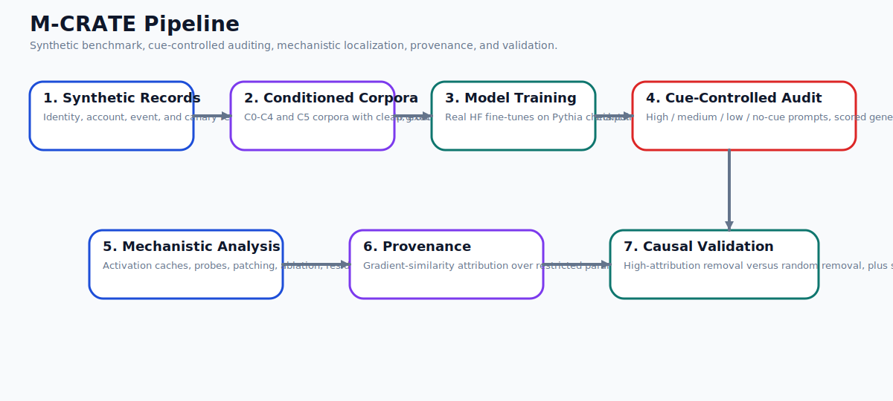
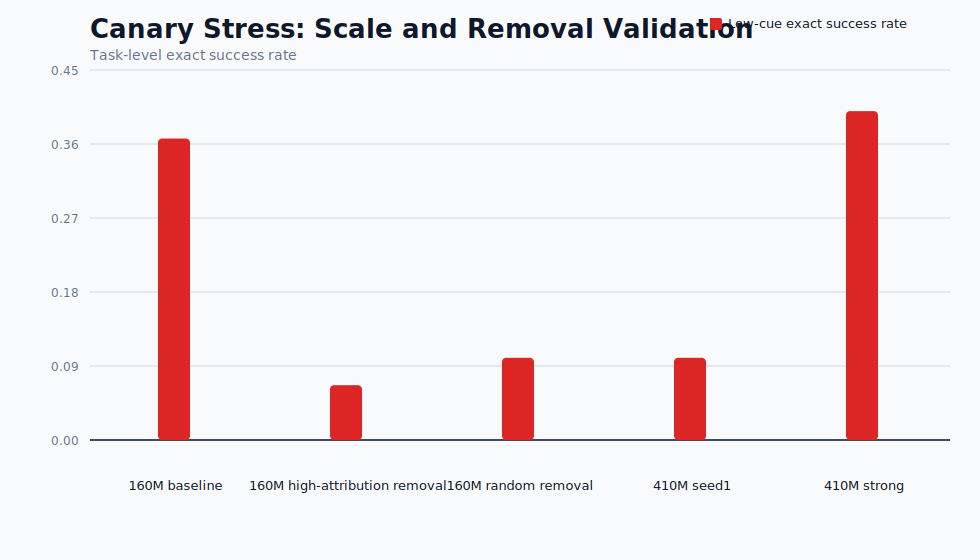
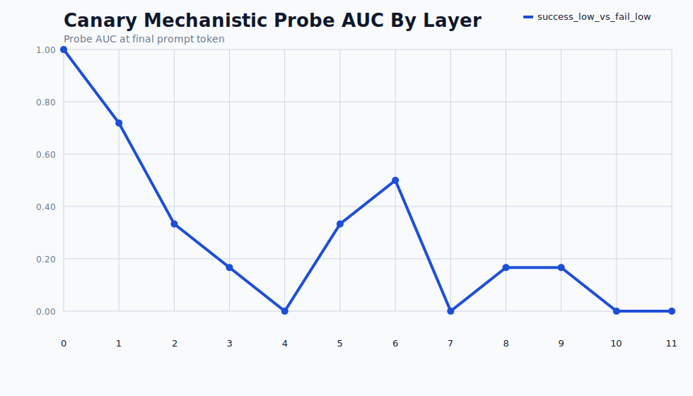
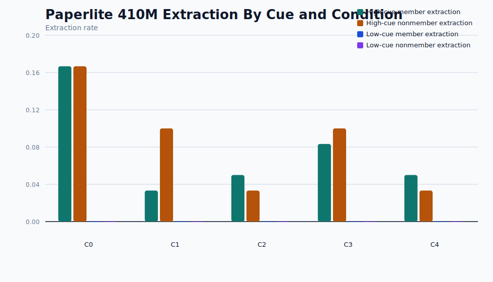
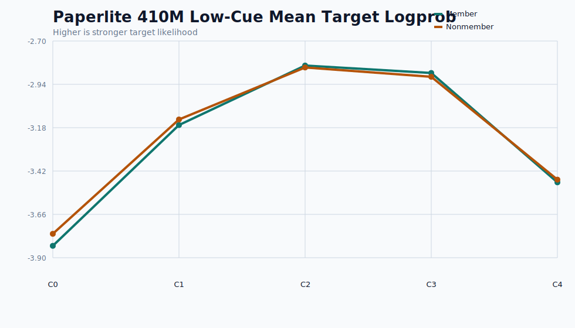
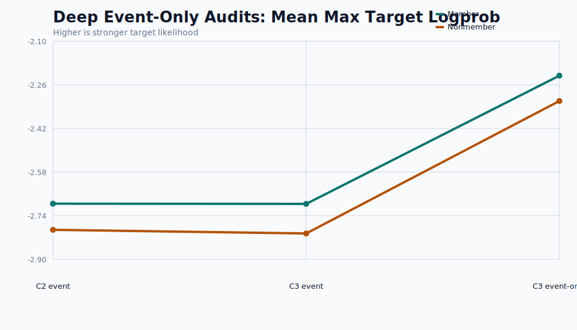

# Findings

## What We Did
We implemented and ran an end-to-end M-CRATE privacy-audit pipeline on real Hugging Face causal language models. The work covered: synthetic record generation; condition-specific corpus construction for clean, exact-duplicate, fuzzy-duplicate, redacted, and canary-heavy settings; cue-controlled prompt construction; real-model fine-tuning; behavioral extraction evaluation; mechanistic probing and intervention on successful canary runs; gradient-similarity provenance; and causal removal validation.

We then extended the project with a tractable `410M` paperlite matrix across `C0-C4` on realistic identity/account/event families, plus deeper long-decode follow-up audits on the conditions that showed latent low-cue signal.

## Why We Did It
The goal of M-CRATE is not just to ask whether a model can emit sensitive-looking text. It asks whether that behavior survives cue control, whether it can be localized to internal computation, and whether the responsible behavior can be traced back to specific training records or duplicate clusters. That requires combining behavioral privacy evaluation, mechanistic interpretability, and provenance rather than treating them as separate projects.

## Why This Is Novel
The project is novel in three ways. First, it explicitly separates high-cue completion from low-cue memorization with benchmarked cue bands and member/nonmember controls. Second, it does mechanistic work on extraction behavior rather than on a generic membership proxy alone. Third, it closes the loop from behavior to mechanism to training-origin evidence with attribution and removal experiments, which is stronger than stopping at either extraction rates or interpretability alone.

## Pipeline Graphic

## Main Findings

### 1. Real canary extraction is present at 160M and 410M
- `Pythia-160M` canary-stress baseline: exact low-cue task success `0.3667`.
- First `Pythia-410M` canary run underfit at `0.1000` exact success.
- Stronger `Pythia-410M` schedule recovered and slightly exceeded the 160M result at `0.4000` exact success.

### 2. Provenance and removal validation work on exact canaries
- Corrected exact-record provenance achieved top-1 recovery `3/5 = 0.6000` with `MRR 0.7500`.
- Removal validation was causal, not just suggestive: the 160M baseline exact success rate `0.3667` dropped to `0.0667` after high-attribution removal, versus `0.1000` after matched random removal.

### 3. Mechanistic evidence exists, but it is strongest on the canary setting
- Probe results on the successful 160M canary model show a sharply decodable low-cue signal at early residual-stream layers, especially layers `0` and `1`.
- Activation patching can increase target log-probability in matched failed cases, which is partial causal evidence that these internal states matter.
- Direct logit attribution shows that late layers dominate the immediate readout into the first target token, suggesting a split between earlier retrieval-relevant state and later output formation.
- The current targeted ablation and residual-direction interventions are not yet publishable mitigations because utility damage is still too large and necessity is not cleanly isolated.

### 4. The completed minimal `410M C0-C4` study is now real and informative
- We completed the `full_paper_minimal_cluster` study end to end (`41/41` units): `C0/C1/C4` at seed `1`, `C2/C3` at seeds `1-3`, plus mechanistic, provenance, and removal follow-up on `C2/C3` seed `1`.
- The finished behavioral matrix shows a strong cue effect under the real `budget5` audit: `C1/C2/C3` all show substantial high-cue member-sensitive extraction, while low-cue and no-cue exact extraction remain effectively zero for realistic identity/account/event records.
- The controls behave cleanly. `C0_clean` is near-zero outside tiny high-cue noise, and `C4_redacted` is almost completely flat even under high cue, which supports the interpretation that the large `C1/C2/C3` high-cue rates are exposure-dependent rather than scoring artifacts.

### 5. Realistic families show latent low-cue memorization before overt extraction
- Even though low-cue exact extraction stayed at zero in the mixed-family `budget1` matrix, low-cue target logprob moved in the expected direction in the repeated/fuzzy conditions.
- In the realistic-family matrix, `C2` low-cue member mean target logprob was slightly stronger than nonmember, and `C3` improved that further. The clearest slice was the event family inside `C3`, where member low-cue mean target logprob was stronger than nonmember.
- A focused `C3` event-only rerun strengthened that latent gap further, reaching mean max target logprob `-2.2780` overall and member/nonmember separation in favor of members, but still did not produce exact event-field extraction under long cold decoding.

### 6. The completed minimal study strengthens the cue-control conclusion more than the leakage claim
- In the finished minimal run, realistic-family low-cue matches are extremely rare rather than robust. `C2_exact_10x` seed `1` shows `2/9065` low-cue member matches versus `1/9105` nonmember matches, and `C3_fuzzy_5x` seed `1` shows `1/9065` member matches versus `0/9105` nonmember matches. All low-cue family-level `record_exact` rates remain `0.0`.
- This means the minimal study supports a strong cue-control result: repetition and fuzzy duplication clearly boost high-cue extraction, but strict low-cue realistic-family extraction still largely collapses at this scale.
- The mechanistic, provenance, and removal stages all completed successfully for `C2` and `C3`, which is important as a systems result, but their quantitative outputs are driven by only `1-2` successful low-cue targets and should therefore be treated as exploratory rather than definitive.
- Provenance is numerically perfect on those tiny sets (`C2`: `2/2` targets, `C3`: `1/1` target), and removal nudges mean target logprob downward, but this is not yet the kind of large-sample realistic-family evidence needed for a strong journal claim.

## Scientific Interpretation
- `RQ1 cue validity`: answered more strongly now. In the completed minimal study, cue filtering changes the picture dramatically: high-cue generation can look extractive while low-cue realistic-family exact extraction largely disappears.
- `RQ2 mechanistic separation`: partially answered. We have clear mechanistic separation on canaries, and a completed `C2/C3` mechanistic pipeline in the minimal study, but the realistic-family positive sets are too small for strong interpretation.
- `RQ3 causal mechanism`: partially answered. Patching and probe evidence show that internal states matter, but the current targeted mitigation is not yet clean enough to make a strong efficiency claim.
- `RQ4 training provenance`: answered for exact canaries and demonstrated end to end on the minimal realistic-family `C2/C3` runs, but only on `2` and `1` low-cue targets respectively, so the realistic-family evidence is still too thin.
- `RQ5 targeted mitigation`: partially answered through canary removal validation and minimally through realistic-family removal reruns, but not yet through a low-utility targeted intervention that clearly beats random in a realistic-family setting with nontrivial extraction.

## Storage and Scale Engineering Findings
- Streaming generation to JSONL removed the largest in-memory bottleneck during long audits.
- Activation caches were reduced to `resid_post` and `float16`, which kept mechanistic artifacts compact.
- Provenance candidate pools were corrected to include real distractors and trimmed to a lean exact-canary validation subset, which made attribution both faster and more trustworthy.

## What Is Still Missing For The Full Paper Claim
- Strong-config multi-seed `C0-C4` runs at `410M`, especially `3` seeds for `C0/C1/C4` in addition to the completed `3`-seed `C2/C3` minimal run.
- A realistic-family condition that crosses from low-cue latent signal into nontrivial low-cue extraction above nonmember controls.
- Mechanistic `C2/C3` analysis on a realistic-family run with enough successful low-cue targets to avoid degenerate `1.0` AUCs and tiny-target provenance summaries.
- Fuzzy-cluster provenance and removal validation on `C3` with more than a single positive target.
- A targeted privacy intervention with substantially smaller utility cost.
- The paperlite validation reports still flag a small residual low-cue overlap caveat (`12` prompts crossing a heuristic sensitive-substring threshold), so the prompt set is good enough for pilots but not yet perfectly clean.

## Key Artifact Index
- Minimal study summary: `outputs/full_paper_minimal_cluster/reports/study_summary.md`
- Minimal behavioral reports: `outputs/full_paper_minimal_cluster/reports/behavioral/`
- Minimal mechanistic artifacts: `outputs/full_paper_minimal_cluster/outputs/mech/`
- Minimal provenance artifacts: `outputs/full_paper_minimal_cluster/outputs/provenance/`
- Minimal removal validation: `outputs/full_paper_minimal_cluster/outputs/removal/`
- Canary scale summary: `reports/canary_stress_scale_summary.md`
- Canary removal validation: `reports/canary_stress_removal_validation.md`
- 410M strong canary behavioral report: `reports/canary_stress_pythia_410m_seed1_strong_long_behavioral.md`
- Paperlite `C0-C4` reports: `reports/paperlite_pythia_410m_*_behavioral.md`
- Exact-canary provenance: `outputs/provenance/canary_stress_gradient_similarity_finalnorm_v2.jsonl`
- Mechanistic artifacts: `outputs/mech/canary_stress_pythia_160m/`

## Bottom Line
We now have a completed minimal full-study run, not just a pilot slice. It shows that the end-to-end M-CRATE pipeline works at the planned minimal scale, that cue control changes the interpretation of extraction behavior sharply, that high-cue realistic-family extraction is exposure-sensitive, and that the mechanistic/provenance/removal loop can be executed successfully on realistic-family runs. What it does not yet show is a robust realistic-family low-cue extraction regime with enough positive targets to support strong mechanistic and provenance claims at journal strength.
